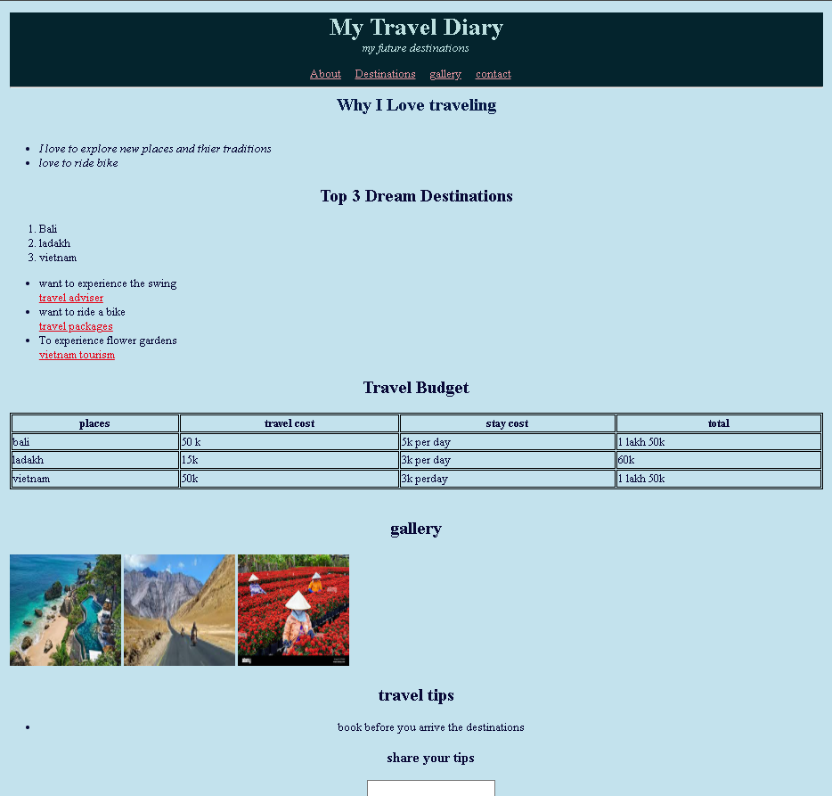

# 🌍 Travel Diary

This is a simple Travel Diary website built using **HTML** and **CSS**. It showcases my journey into web development and my love for travel!

## ✨ Features

- 🧭 **Navigation Bar** – Easy-to-use menu for smooth browsing between pages
- 🖼️ **Images** – Travel photos displayed throughout the site to bring memories to life
- 📄 **Multiple Pages** – Structured content organized into different sections (e.g., Destinations, Gallery, About)
- 🔻 **Footer** – Informative footer with links and contact details

## 🔧 Technologies Used

- **HTML5** – For structuring content
- **CSS3** – For styling and layout

## 📁 How to Use

1. Clone or download the repository
2. Open `index.html` in your browser
3. Navigate through the pages and explore the content

## 📸 Preview

---

Thanks for checking out my Travel Diary! Feel free to leave feedback or suggestions.
